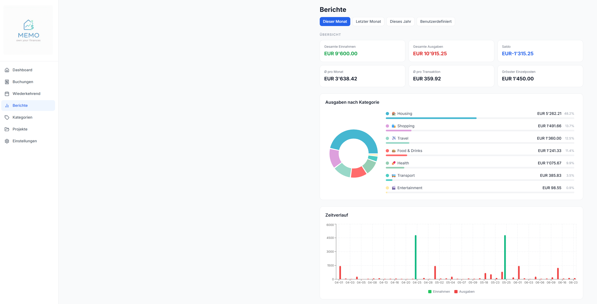
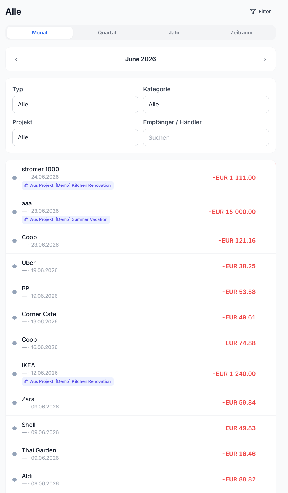
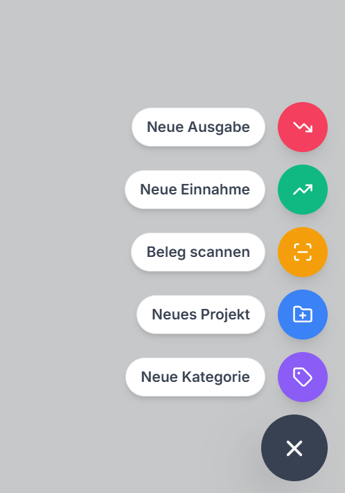
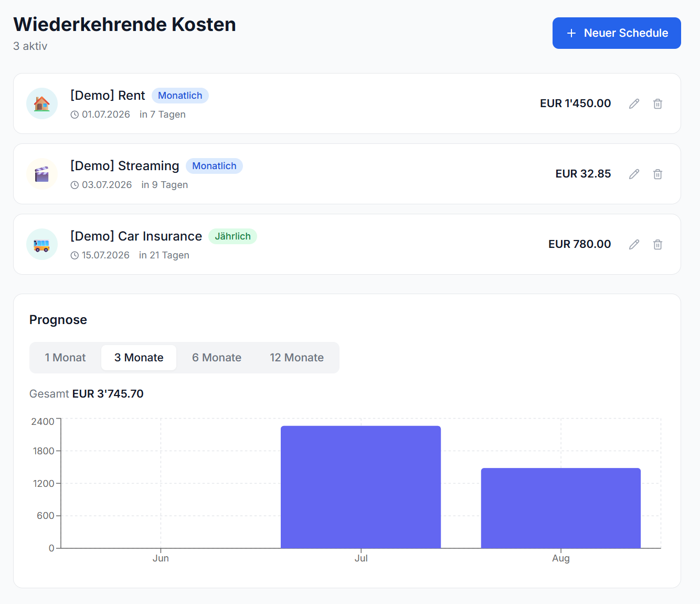
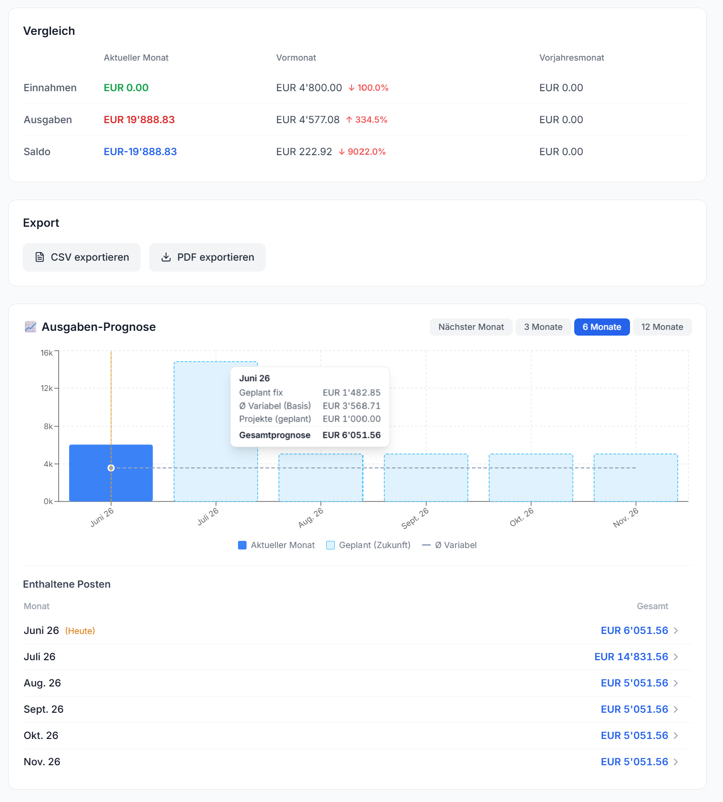
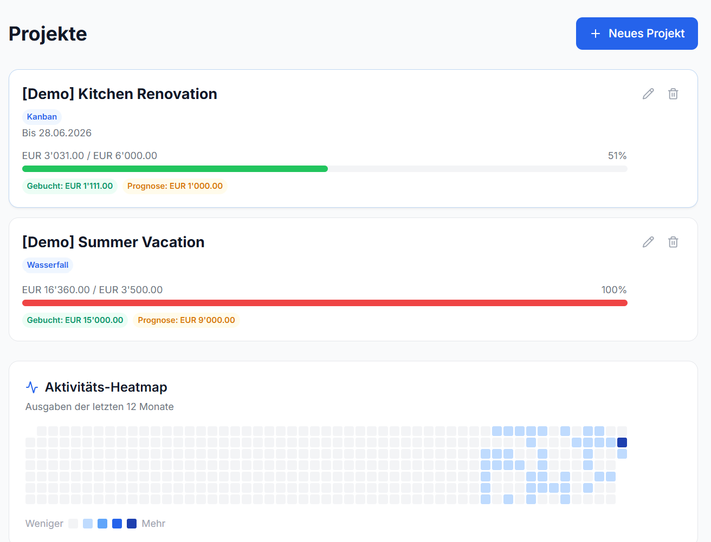
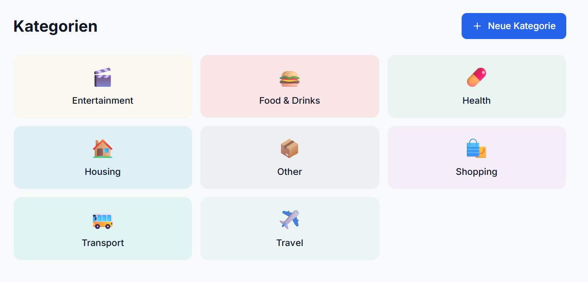
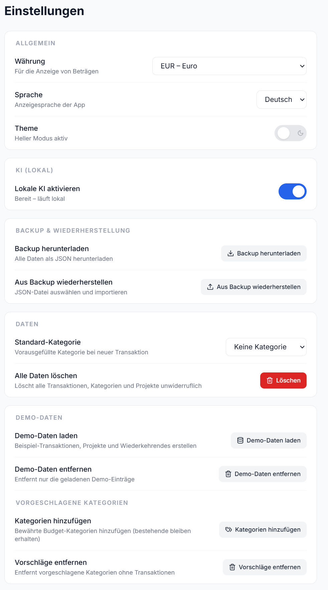

> [!IMPORTANT]
> This repository contains an independent Chinese localization derived from
> [LuMeX88/MEMO-Finance-Tracker](https://github.com/LuMeX88/MEMO-Finance-Tracker).
> It adds Simplified Chinese, CNY/RMB support, Chinese receipt OCR, and related
> mobile layout fixes. It is not affiliated with or endorsed by the upstream
> maintainer. The original and modified code remain licensed under GNU GPL v3;
> see [LICENSE](LICENSE), [NOTICE.md](NOTICE.md), and the source history.

<div align="center">

# 💰 MEMO – Finance Tracker

### *own your finances*

**M**oney · **E**xpense · **M**anagement · **O**verview

A modern, lightweight, **local-first** personal finance tracker that runs as a
**Home Assistant add-on** — no cloud, no subscriptions, no telemetry. Everything
lives in a local SQLite database on your own hardware, and your key finance
metrics are published to Home Assistant as **MQTT sensors** for dashboards and
automations.

[](LICENSE)
&nbsp;
[](https://www.home-assistant.io/)
&nbsp;

&nbsp;


<br>

**One-click install — add the repository to your Home Assistant:**

[](https://my.home-assistant.io/redirect/supervisor_add_addon_repository/?repository_url=https%3A%2F%2Fgithub.com%2Faemediatodd%2FMEMO-Finance-Tracker-CN_Chinese)

<br>

If MEMO makes your life easier, you can support its development:

<a href="https://www.buymeacoffee.com/LuMeX88" target="_blank"></a>

<br><br>



</div>

---

## ⚠️ Prerequisites

MEMO integrates with Home Assistant through **MQTT**. Before installing, make sure you have:

| Requirement | Notes |
|---|---|
| **Home Assistant OS or Supervised** | Required to install add-ons. |
| **MQTT broker — [Mosquitto add-on](https://github.com/home-assistant/addons/tree/master/mosquitto)** | **Required.** Install *Mosquitto broker* from **Settings → Add-ons → Add-on Store** and start it. |
| **MQTT integration enabled** | **Settings → Devices & Services → Add Integration → MQTT**, pointed at your broker. This is what turns MEMO's published topics into sensor entities via MQTT Discovery. |
| **MQTT user / credentials** | Create a Home Assistant user (or Mosquitto local user) for MEMO to authenticate against the broker. |

> Without a running MQTT broker (Mosquitto) and the MQTT integration, MEMO still works as a finance app, but **no Home Assistant sensor entities will be created**.

---

## 🤔 Why MEMO?

Most finance apps live in the cloud, share your data, and cost a monthly fee. MEMO is different. It runs on your own hardware, stores everything locally in SQLite, and integrates natively with Home Assistant — including single sign-on through the Home Assistant sidebar (Ingress). Your data never leaves your home.

---

## ✨ Features

- **📊 Dashboard** – Real-time overview of income, expenses, balance and trends.
- **💸 Transactions** – Log income and expenses with category, recipient, payment
  method and notes. Filter by type, category, project, recipient and period
  (month / quarter / year / custom).
- **🔁 Schedules** – Manage recurring costs (rent, subscriptions, utilities) with
  fixed or variable amounts, plus **smart suggestions** that detect recurring
  patterns in your transactions and offer to turn them into schedules.
- **📁 Projects (Kanban & Waterfall)** – Plan work as a Kanban board or a
  Waterfall timeline, set a **budget**, and track **forecast vs booked** costs.
  Allocate each task's cost to a **category**, give Kanban tasks an **estimated
  completion date**, and have those planned costs flow into your expense forecast.
- **📈 Forecasting** – Automatic monthly, quarterly and yearly expense forecast
  from schedules, spending averages **and planned project task costs**.
- **🧾 Reports & Export** – Income/expense totals, monthly averages, biggest
  transactions, expenses by category, timelines, period comparisons and one-click
  **CSV / PDF export** (generated locally in your browser).
- **🏷️ Categories** – Fully customizable categories with icons and colors, plus a
  one-click set of **best-practice budgeting categories**.
- **📷 Receipt Scanning (OCR)** – Capture a receipt with your **camera** or pick an
  existing **image file**. Local Tesseract + OpenCV pre-processing auto-fills
  amount, date and recipient as a suggestion.
- **🧠 Embedded Local AI** *(optional, off by default)* – An on-device **vision**
  model (Qwen2.5-VL-3B) runs **inside the add-on** – no Ollama, no cloud. It reads
  the **amount, date and merchant straight from a receipt photo**, auto-categorizes
  new transactions and writes a short monthly insight. **Enable it from Settings**
  when you want it – a popup shows the system requirements first, and the ~2.8 GB
  model is then downloaded **on demand** with a live **progress bar**.
- **🧪 Demo data** – One-click **load/remove** of realistic sample data so you can
  explore every feature, removed again without touching data you created.
- **💾 Backup & Restore** – Download all your data as JSON and restore it again.
- **🛰️ MQTT Sensor Entities** – Key metrics published to Home Assistant via MQTT
  Discovery (see below).
- **🔐 Home Assistant Ingress** – Open MEMO straight from the HA sidebar;
  authentication handled by Home Assistant.
- **🌍 Multilingual** – German & English, with **light / dark** mode.

---

## � Screenshots

<table>
  <tr>
    <td width="50%"><br><sub><b>Transactions</b> — filter by type, category, project, merchant & period</sub></td>
    <td width="50%"><br><sub><b>Quick add</b> — speed dial for expense, income, receipt scan, project & category</sub></td>
  </tr>
  <tr>
    <td width="50%"><br><sub><b>Recurring costs</b> — schedules with a 1–12 month forecast</sub></td>
    <td width="50%"><br><sub><b>Reports & forecast</b> — period comparison, CSV/PDF export, expense forecast</sub></td>
  </tr>
  <tr>
    <td width="50%"><br><sub><b>Projects</b> — Kanban / Waterfall, budget vs booked, activity heatmap</sub></td>
    <td width="50%"><br><sub><b>Categories</b> — fully customizable with icons & colors</sub></td>
  </tr>
  <tr>
    <td width="50%"><br><sub><b>Settings</b> — local AI toggle, backup/restore, demo data & suggested categories</sub></td>
    <td width="50%"></td>
  </tr>
</table>

---

## �🚀 Installation

### Option A — one-click (recommended)

Click the button below to open your Home Assistant and add the MEMO repository,
then install the add-on from the store:

[](https://my.home-assistant.io/redirect/supervisor_add_addon_repository/?repository_url=https%3A%2F%2Fgithub.com%2Faemediatodd%2FMEMO-Finance-Tracker-CN_Chinese)

### Option B — manual

1. In Home Assistant, go to **Settings → Add-ons → Add-on Store**.
2. Open the **⋮ menu (top-right) → Repositories**, paste this URL and click **Add**:
   ```
   https://github.com/aemediatodd/MEMO-Finance-Tracker-CN_Chinese
   ```
3. Find **MEMO – Finance Tracker** in the store and click **Install**.

### After installing

1. Make sure the **Mosquitto broker** add-on is installed and **running** (see
   [Prerequisites](#️-prerequisites)).
2. Open the MEMO **Configuration** tab and set your MQTT details (see below).
   Leave the username/password empty to inherit them from the broker add-on.
3. Click **Save**, then **Start** the add-on.
4. Check the **Log** tab to confirm it started cleanly.
5. Open the UI from the **sidebar** (Ingress) or the **Open Web UI** button.

> 💡 Home Assistant only rebuilds the add-on when the version changes. After an
> update isn't showing, use **⋮ → Check for updates** in the Add-on Store.

---

## ⚙️ Configuration

The add-on exposes the following options:

| Option | Default | Description |
|---|---|---|
| `ai_enabled` | `false` | Enable the embedded local **vision** AI (receipt reading, auto-categorization, monthly insight). **Off by default** — enabling it triggers a one-time ~2.8 GB model download (shown with a progress bar in **Settings → AI (local)**) and needs ~4 GB free RAM. Can also be toggled in **Settings**. |
| `mqtt_host` | `core-mosquitto` | Hostname of your MQTT broker. Use `core-mosquitto` for the official Mosquitto add-on. |
| `mqtt_port` | `1883` | MQTT broker port. |
| `mqtt_username` | – | MQTT username (a Home Assistant / Mosquitto user). |
| `mqtt_password` | – | MQTT password. |
| `mqtt_base_topic` | `memo` | Base topic MEMO publishes to. |
| `mqtt_discovery_prefix` | `homeassistant` | Home Assistant MQTT Discovery prefix. |
| `mqtt_currency` | `¥` | Currency unit used for the monetary sensors. |
| `mqtt_publish_interval` | `300` | How often (in seconds) metrics are re-published. |

The SQLite database is stored in the add-on's persistent `/data` volume and is included in Home Assistant backups.

---

## 📊 Home Assistant Sensor Entities

Once MQTT is configured, MEMO registers a **MEMO Finance Tracker** device with these sensors via MQTT Discovery:

```yaml
sensor.memo_income_this_month          # device_class: monetary
sensor.memo_expenses_this_month        # device_class: monetary
sensor.memo_balance_this_month         # device_class: monetary
sensor.memo_transactions_this_month    # count of transactions this month
```

These can be used directly in dashboards, history graphs and automations (e.g. "notify me when monthly expenses exceed €X").

---

## 🧠 Local AI (optional, 100% on-device)

MEMO can run a small embedded **vision** language model so smart features work **without any cloud service or separate Ollama container**. It is **off by default** — turn it on in the add-on configuration or via **Settings → AI (local)** (a popup shows the system requirements first).

- **Model:** Qwen2.5-VL-3B-Instruct (GGUF, Q4_K_M, ~1.9 GB) plus its vision encoder / mmproj (~850 MB), running via `llama.cpp` on CPU.
- **First enable:** the model is downloaded **on demand** — only the moment you switch the AI on — into the persistent `/data/models` volume, with a live **progress bar** in **Settings → AI (local)**. This keeps the initial add-on install fast and makes the AI a deliberate choice. This is the **only** time MEMO touches the network for AI; all inference happens locally afterwards. The download runs in the background and never blocks the app.
- **What it does (the AI features):**
  - **Receipt scan (OCR)** – reads the **amount, date and merchant directly from a receipt photo** with the vision model. Far more accurate than plain text OCR.
  - **Auto-categorization** – when you add a transaction without picking a category, the model suggests the best-matching one (falling back to a default if unsure).
  - **Monthly insight** – an "AI Insight" card on the dashboard summarizes the last 30 days in two or three sentences with one saving tip.
- **Without AI:** receipt scanning still works using the lightweight **Tesseract OCR + regex** fallback (no big download, fast even on weak hardware); categorization falls back to a default and the insight card simply invites you to enable AI.
- **Disable it:** set `ai_enabled: false` in the add-on configuration, or use the **AI (local)** toggle under **Settings**. Every AI feature then degrades gracefully and the rest of the app keeps working.

---

## ⚙️ System requirements for the AI features (local)

The on-device AI is optional and **off by default**. To turn it on, your Home Assistant host should meet roughly these requirements:

| Resource | Recommended | Notes |
|---|---|---|
| **Free RAM** | **~4 GB** free for MEMO | The 3B vision model needs ~3.5 GB resident while loaded. |
| **CPU** | 64-bit, modern (**AVX2**) | Runs CPU-only. On a Proxmox VM set the CPU type to **host** so AVX2 is available — otherwise inference is much slower (or the model may fail to load). |
| **Disk** | **~3 GB** free in `/data` | One-time download (model ~1.9 GB + vision encoder ~850 MB), stored in `/data/models`. |
| **Network** | once, for the download | Only the first-time model download; all inference is then 100% local / offline. |

> ⏱️ **It can be slow.** Depending on your hardware, the **first model load** and **every AI action** can take noticeably longer — on weak CPUs (few cores, no AVX2) up to **a minute per receipt**. If the receipt-scan AI step exceeds its time budget, MEMO automatically falls back to the fast Tesseract OCR result. If your hardware is limited, simply keep the AI features **off**.

---

## 📁 Project management (Kanban & Waterfall)

Open any project to plan and cost out larger goals (a renovation, a trip, a build):

- **Two modes** – a **Kanban** board (To Do / In Progress / Done columns with
  drag & drop) or a **Waterfall** timeline sorted by date.
- **Budget & cost tracking** – set a project budget and watch the bar fill as
  costs move from **forecast** (planned) to **booked** (actual).
- **Booked costs become real bookings** – when a task is *done* (Kanban) or its
  end date passes (Waterfall), its cost is mirrored into a normal **expense
  booking**, so it shows up in Transactions, Reports and the budget bar.
- **Category allocation** – give each task a **category**; its booked cost is
  filed there instead of a generic "Other", keeping *Expenses by Category* useful.
- **Time-based forecast** – give a task an **estimated completion date** and its
  planned cost is projected into the **expense forecast** for that month.

---

## 🛠️ Tech Stack

| Layer | Technology |
|---|---|
| Frontend | React + TypeScript + Vite + Tailwind CSS |
| Backend | FastAPI (serves both the REST API and the built frontend) |
| Database | SQLite (local, in `/data`) |
| OCR (fallback) | Tesseract via pytesseract + OpenCV pre-processing + Pillow |
| Local AI (optional) | llama.cpp (`llama-cpp-python`) + Qwen2.5-VL-3B-Instruct GGUF (vision) |
| Pattern Matching | rapidfuzz |
| HA Integration | MQTT Discovery (paho-mqtt) + Ingress |
| Auth | Home Assistant (via Ingress) |

The add-on runs as a **single container**: FastAPI serves the compiled React app and the API on one port, which Home Assistant exposes through Ingress.

---

## 💻 Development / Standalone

MEMO can also run outside Home Assistant for development.

**Docker (standalone):**
```bash
docker compose up --build
# frontend: http://localhost:3000   backend: http://localhost:8000
```

**Local dev (hot reload):**
```bash
# Backend
cd backend
python -m uvicorn app.main:app --reload --port 8000

# Frontend (separate terminal)
cd frontend
npm install
npm run dev          # http://localhost:5173 (proxies /api to :8000)
```

To enable MQTT in standalone/dev mode, copy `backend/.env.example` to `backend/.env` and set `MQTT_HOST` (and credentials). If `MQTT_HOST` is empty, the MQTT feature stays disabled and the app runs normally.

---

## ✅ Tested environments

MEMO's interface is actively tested on:

- **Google Chrome** (desktop)
- **Microsoft Edge** (desktop)
- **Home Assistant Companion app** (Android)

Other modern browsers are expected to work but are not regularly tested. The
in-app receipt camera requires camera permission to be granted to the Home
Assistant Companion app's webview.

---

## ☕ Support

MEMO is free and open-source. If it helps you stay on top of your finances,
consider buying me a coffee — it genuinely helps and is hugely appreciated. 🙏

<a href="https://www.buymeacoffee.com/LuMeX88" target="_blank"></a>

---

## 🧭 Philosophy

> local. private. yours.

MEMO is built on the belief that your financial data belongs to you and only you. No accounts, no sync, no telemetry. Everything runs on your own machine, backed up with your Home Assistant backup.

---

## 📄 License

GNU GENERAL PUBLIC LICENSE Version 3
